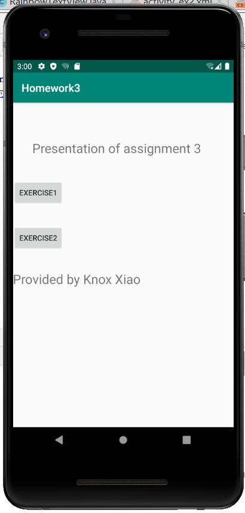
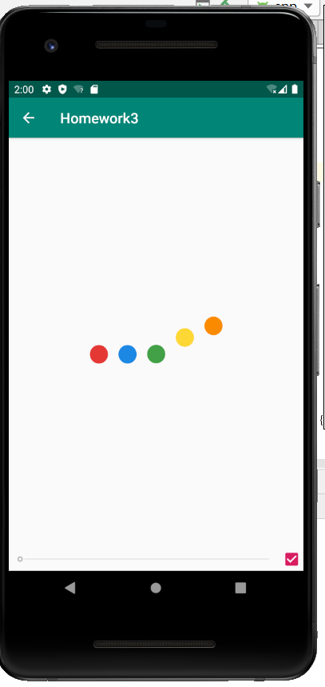
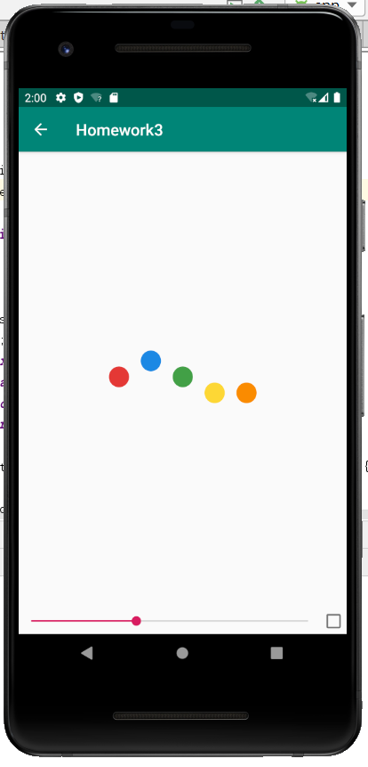
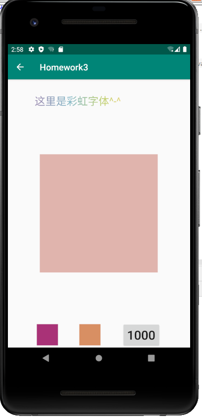
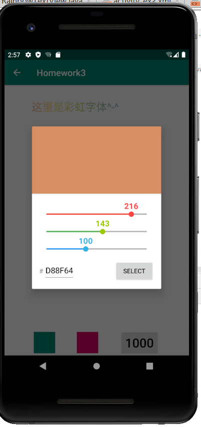
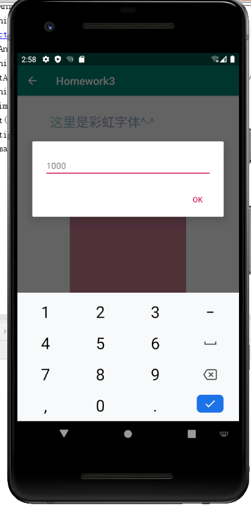

#### HomeWork3：

##### 初始页面：

##### EX1

勾选右下角开始播放动画

可以拖动下方进度条观看不同时期的动画帧

##### ex2:

颜色、大小、透明度均发现变化

可以调整 RGB值改变颜色。（因为自己写的调色器只能用几种最基本的颜色，所以选择了使用jcenter中已经封装好的调色器，https://github.com/Pes8/android-material-color-picker-dialog）

调整单次执行时间（使用到了material dialog，https://github.com/afollestad/material-dialogs）

##### EX3：

仍在完成中，完成后会上传到github本仓库中